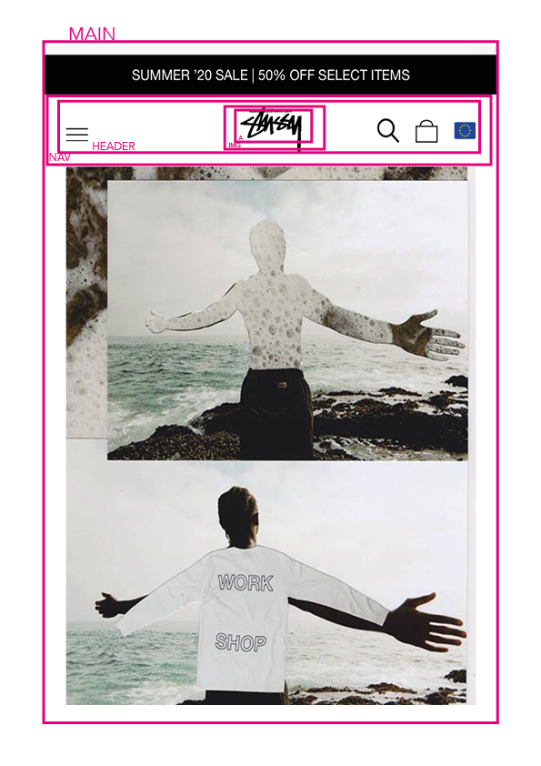

# Procesverslag
**Auteur:** -jouw naam-

Markdown cheat cheet: [Hulp bij het schrijven van Markdown](https://github.com/adam-p/markdown-here/wiki/Markdown-Cheatsheet). Nb. de standaardstructuur en de spartaanse opmaak zijn helemaal prima. Het gaat om de inhoud van je procesverslag. Besteedt de tijd voor pracht en praal aan je website.

## Bronnenlijst
1. -bron 1-
2. -bron 2-
3. -...-

## Eindgesprek (week 7/8)

-dit ging goed & dit was lastig-

**Screenshot(s):**

-screenshot(s) van je eindresultaat-

## Voortgang 3 (week 6)

-same as voortgang 1-

## Voortgang 2 (week 5)

-same as voortgang 1-

## Voortgang 1 (week 3)

### Stand van zaken

-dit ging goed & dit was lastig-

**Screenshot(s):**

-screenshot(s) van hoe ver je bent-

### Agenda voor meeting

-samen met je groepje opstellen-

### Verslag van meeting

-na afloop snel uitkomsten vastleggen-

## Intake (week 1)

**Je startniveau:** 
Rood, de basis kan ik maar ik zal het even omhoog moeten halen in mijn hoofd. Ik ben dus een gemiddelde beginner die nieuwgierig is om meer te leren over programmeren. 

**Je focus:** 
De site is wel responsive wanneer de gebruiker op knoppen of plaatjes drukt leidt dat naar weer een ander scherm. De gebruiker is instaat om te communiceren met de site door middel van sprekende beelden en verschillende pagina's. 

**Je opdracht:** 

https://www.stussy.com

**Screenshot(s):**

**Breakdown-schets(en):**

