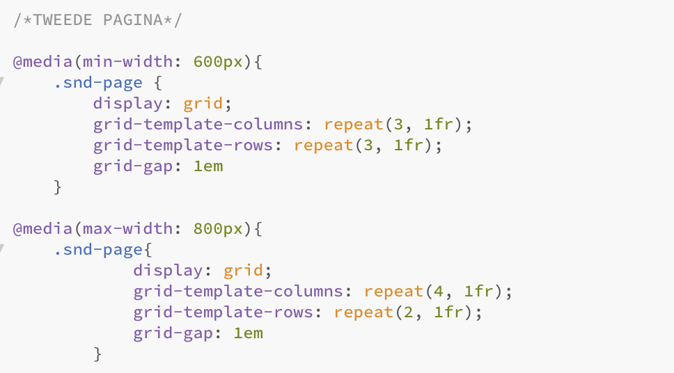
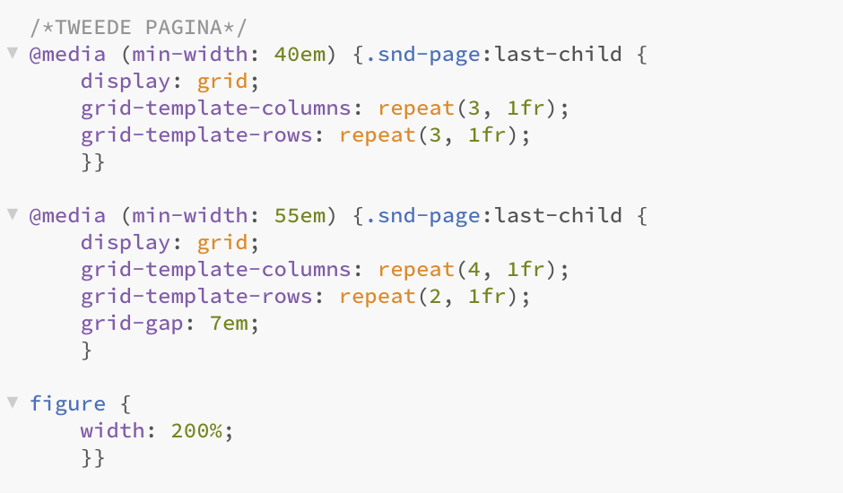
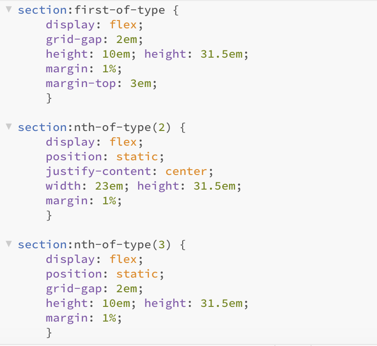
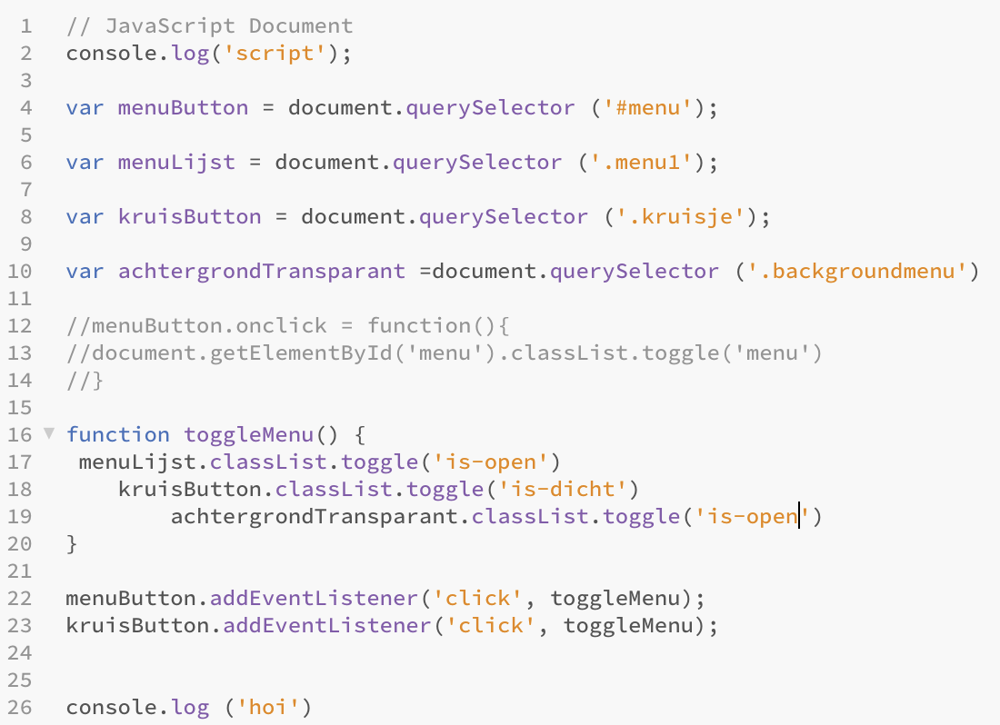
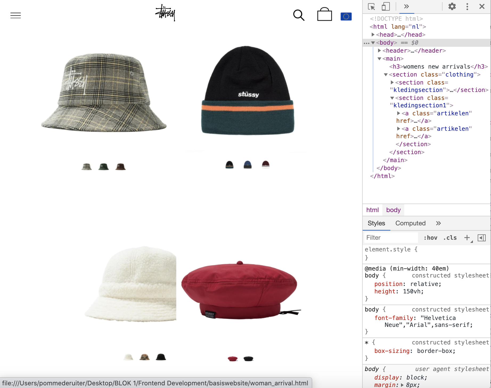
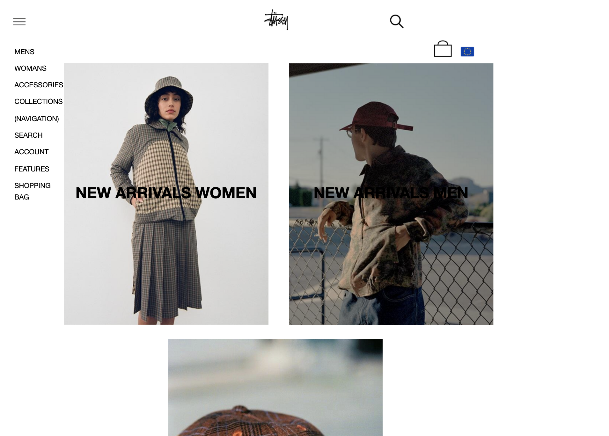
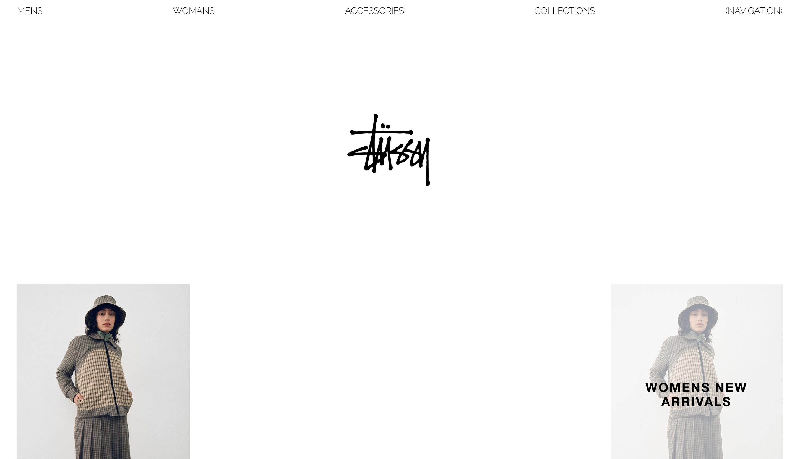
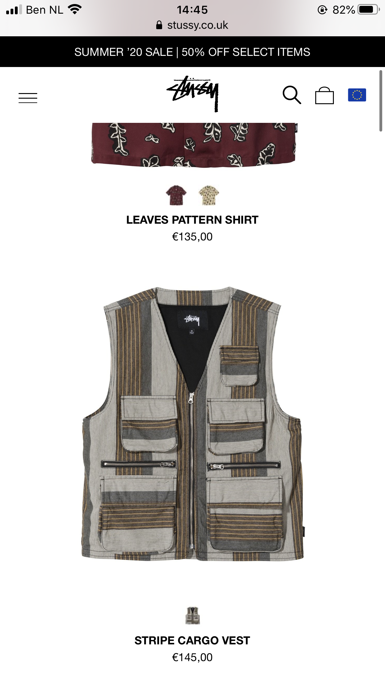
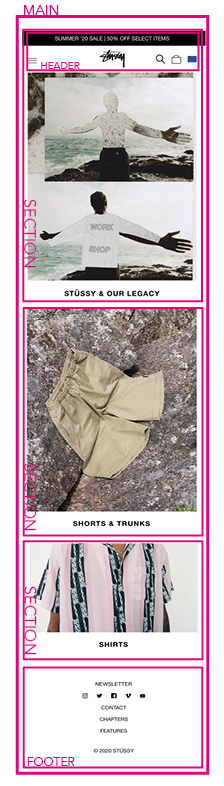

# Procesverslag
**Auteur:** -Pomme de Ruiter-

Markdown cheat cheet: [Hulp bij het schrijven van Markdown](https://github.com/adam-p/markdown-here/wiki/Markdown-Cheatsheet). Nb. de standaardstructuur en de spartaanse opmaak zijn helemaal prima. Het gaat om de inhoud van je procesverslag. Besteedt de tijd voor pracht en praal aan je website.

## Bronnenlijst
1. https://css-tricks.com/snippets/css/a-guide-to-flexbox/
2. https://grid.layoutit.com
3. CodePen
4. DLO oefeningen
5. https://cssreference.io
6. https://htmlreference.io
7. https://validator.w3.org/
8. https://stackoverflow.com
9. https://www.stussy.com

## Eindgesprek (week 7/8)

Ik ben bezig met de footer en de tweede pagina. Op de tweede pagina wordt de kleding laten zien in grids. De grids moeten responsive zijn, van twee artikelen naast elkaar naar drie en uiteindelijk naar vier. Ik moet dat dus met colums en rows gaan regelen. 

De grids waarmee het niet lukt. De @media werkt niet want die wordt overschreven. Ik heb het probleem gevonden. Dit is het eindresultaat:

Punten die goed gaan:
- De navigatie is nu eindelijk klaar, ik moest het vast zetten met fixed.
- Ik heb Java Script toegevoegd en het werkt.

Punten die ik lastig vind:
- Grid werkt niet.
- Footer werkt niet.
- @media reageert niet meer.
- JavaScript op de tweede pagina werkt niet.

Met het stoeien met grid heeft deze oefenopdracht mij heel erg geholpen.

## Voortgang 3 (week 6)

Ik ben nu bezig met grid toepassen, helaas werkt het niet. Ik had mijn code even laten bekijken door klasgenoten en ik heb een paar belangrijke tips gekregen. Ik heb al mijn classes aangepast en heb nu first-of-type overal. Ik kende die code wel al maar had daar helemaal niet overnagedacht. Ik heb het nu allemaal aangepast. 

Punten die ik lastig vind:
- Grid
- @media niet zo werkt als ik wil
- met Kris gebeld en het hamburger menu gefixt, met behulp van javascript. 

Punten die goed gaan:
- Ik heb het gevoel dat ik flex-box nu wel echt onder de knie krijg.

Grids werken wel maar de grid-gap ineens niet meer...

## Voortgang 2 (week 5)

Ik ben nu al vijf weken aan het werk aan mijn website en het komt nu eindelijk een beetje together. Ik moet wel zeggen dat ik het erg heb onderschat. Ik moet ontzettend veel dingen opzoeken en dat kost veel tijd. Onderwerp wat bijvoorbeeld moet opzoeken is, hoe kan je meerdere elementen onder één @media (breakpoint) zetten. Daar ben ik dan best een tijd mee bezig om het juiste antwoord te vinden omdat veel mensen het op verschillende manieren doen. 

Punten die ik lastig vind:
- responsive maken van de website
- De hoeveelheid huiswerk opdrachten 
- Flex box

Punten die goed gaan:
- Ik heb een image resize tool gevonden die goed werk. Het maakt alle images dezelfde grote.
- De feedback van Kris heeft mij erg geholpen
- Joost had mijn site als voorbeeld genomen en helemaal gecodeerd, daarvan heb ik veel codes overgenomen. 

Mijn pagina op dit moment 

## Voortgang 1 (week 3)

-Lastig-

Het zoeken van de het font dat wordt gebruikt op de Stussy site. De huiswerk oefeningen waren ook best lastig maar toen ik eenmaal bezig was lukte het wel. 
Ik ben gaan stuntelen met positionering en flex box, door de oefeningen is die informatie weer even ververst. 

Ik was begonnen met desktop formaat, ik heb het nu aangepast tot mobile. Daardoor moest ik wel weer opnieuw beginnen dus dar nam wel wat tijd inbeslag. 

-Makkelijk-

Ik was helemaal vergeten dat je natuurlijk in de Inspect kan kijken van een website. Op die manier kan is het super makelijk om het lettertype te achterhalen. 
Nu weet ik dus welk font er wordt gebruikt en kan ik dat toepassen. 

In principe heb ik een website met veel plaatjes en simpele text. Het werkt wel mee dat ik niet een belachelijk lastige site heb uitgekozen. 

### Agenda voor meeting

- Hoe doe je bewegende beelden in je site? Het is niet echt een video.
- Hoeveel pagina's moet je eigenlijk maken?
- Een imange dof maken?

### Verslag van meeting

-na afloop snel uitkomsten vastleggen-

## Intake (week 1)

**Je startniveau:** 
Rood, de basis kan ik maar ik zal het even omhoog moeten halen in mijn hoofd. Ik ben dus een gemiddelde beginner die nieuwgierig is om meer te leren over programmeren. 

**Je focus:** 
De site is wel responsive wanneer de gebruiker op knoppen of plaatjes drukt leidt dat naar weer een ander scherm. De gebruiker is instaat om te communiceren met de site door middel van sprekende beelden en verschillende pagina's. 

**Je opdracht:** 

https://www.stussy.com

**Screenshot(s):**

**Breakdown-schets(en):**

