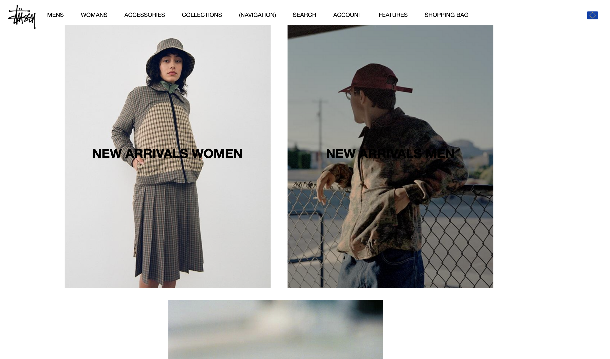
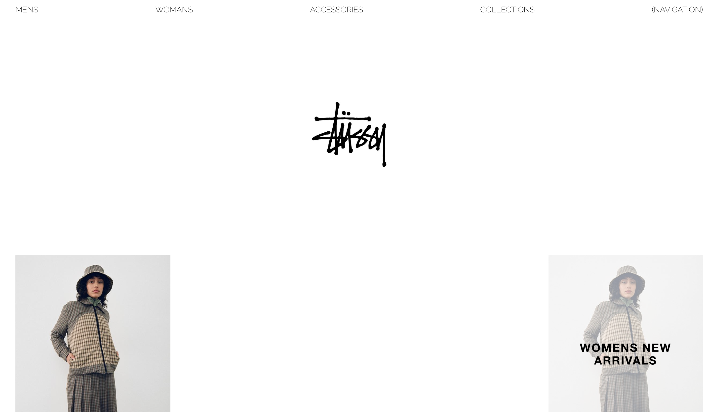
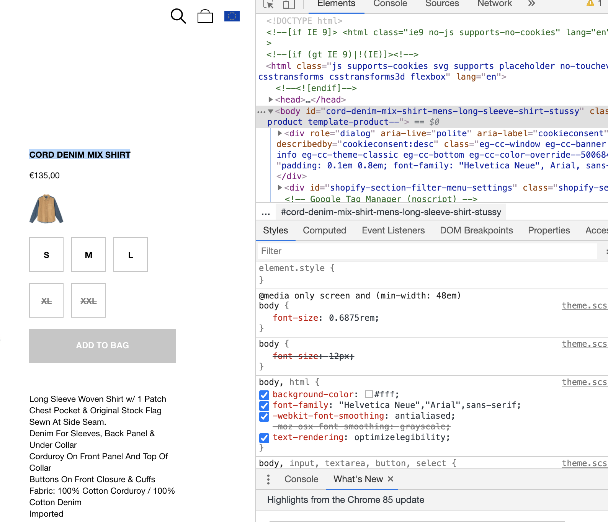
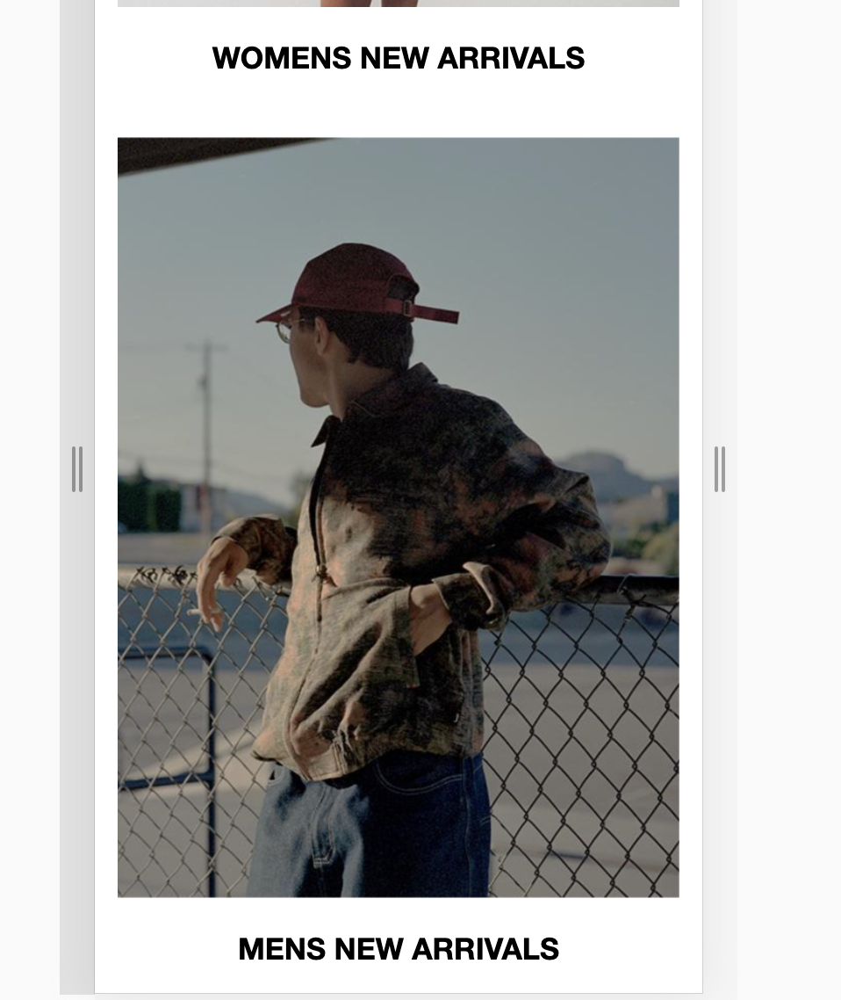
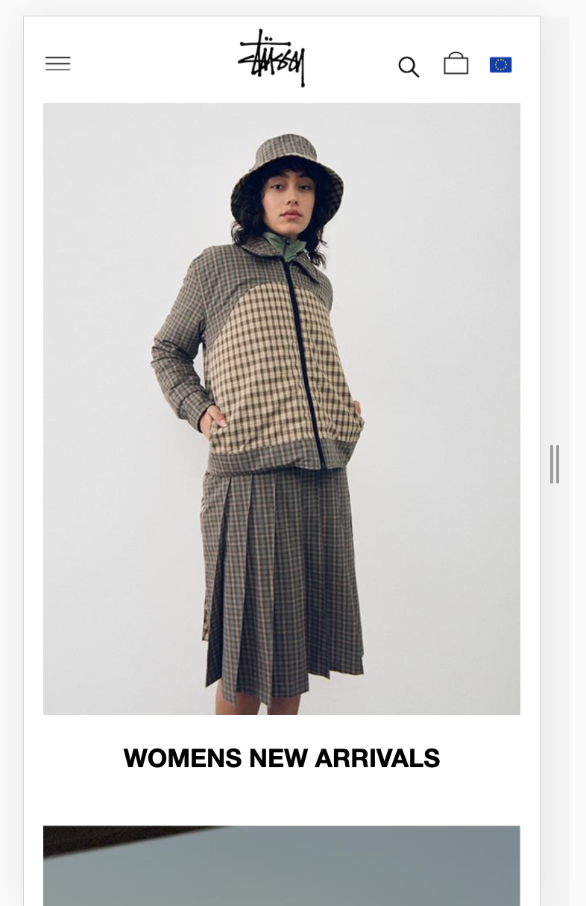
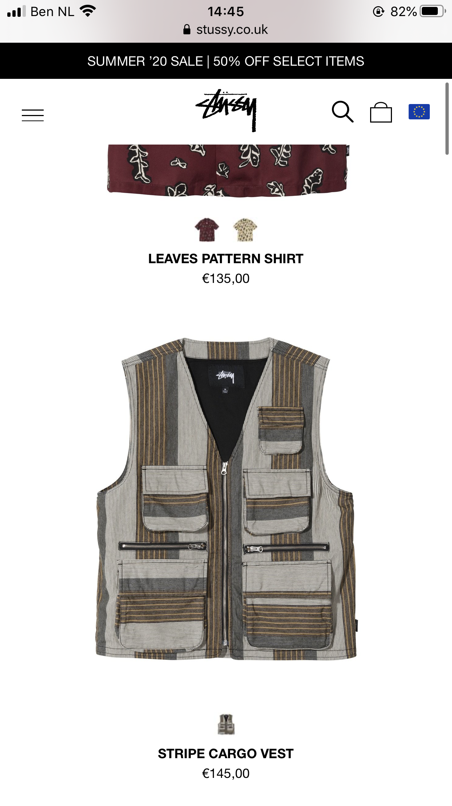
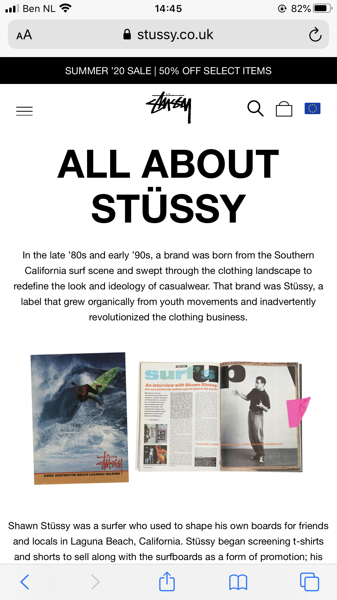
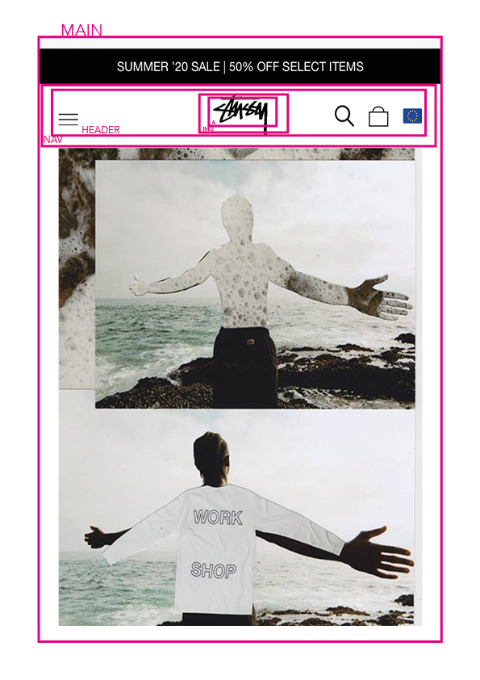
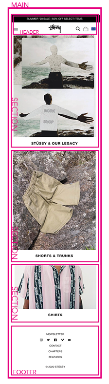

# Procesverslag
**Auteur:** -jouw naam-

Markdown cheat cheet: [Hulp bij het schrijven van Markdown](https://github.com/adam-p/markdown-here/wiki/Markdown-Cheatsheet). Nb. de standaardstructuur en de spartaanse opmaak zijn helemaal prima. Het gaat om de inhoud van je procesverslag. Besteedt de tijd voor pracht en praal aan je website.

## Bronnenlijst
1. -bron 1-
2. -bron 2-
3. -...-

## Eindgesprek (week 7/8)

-dit ging goed & dit was lastig-

**Screenshot(s):**

-screenshot(s) van je eindresultaat-

## Voortgang 3 (week 6)

-same as voortgang 1-

## Voortgang 2 (week 5)

Ik ben nu al vijf weken aan het werk aan mijn website en het komt nu eindelijk een beetje together. Ik moet wel zeggen dat ik het erg heb onderschat. 

Punten die ik lastig vind:
- responsive maken van de website
- De hoeveelheid huiswerk opdrachten 
- Flex box

Punten die goed gaan:
- Ik heb een image resize tool gevonden die goed werk. Het maakt alle images dezelfde grote.
- De feedback van Kris heeft mij erg geholpen
- Joost had mijn site als voorbeeld genomen en helemaal gecodeerd, daarvan heb ik veel codes overgenomen. 

Mijn pagina op dit moment 

## Voortgang 1 (week 3)

### Stand van zaken

-Lastig-

Het zoeken van de het font dat wordt gebruikt op de Stussy site. De huiswerk oefeningen waren ook best lastig maar toen ik eenmaal bezig was lukte het wel. 
Ik ben gaan stuntelen met positionering en flex box, door de oefeningen is die informatie weer even ververst. 

Ik was begonnen met desktop formaat, ik heb het nu aangepast tot mobile. Daardoor moest ik wel weer opnieuw beginnen dus dar nam wel wat tijd inbeslag. 

-Makkelijk-

Ik was helemaal vergeten dat je natuurlijk in de Inspect kan kijken van een website. Op die manier kan is het super makelijk om het lettertype te achterhalen. 
Nu weet ik dus welk font er wordt gebruikt en kan ik dat toepassen. 

In principe heb ik een website met veel plaatjes en simpele text. Het werkt wel mee dat ik niet een belachelijk lastige site heb uitgekozen. 

### Agenda voor meeting

Hoe doe je bewegende beelden in je site? Het is niet echt een video.
Hoeveel pagina's moet je eigenlijk maken?
Een imange dof maken?

### Verslag van meeting

-na afloop snel uitkomsten vastleggen-

## Intake (week 1)

**Je startniveau:** 
Rood, de basis kan ik maar ik zal het even omhoog moeten halen in mijn hoofd. Ik ben dus een gemiddelde beginner die nieuwgierig is om meer te leren over programmeren. 

**Je focus:** 
De site is wel responsive wanneer de gebruiker op knoppen of plaatjes drukt leidt dat naar weer een ander scherm. De gebruiker is instaat om te communiceren met de site door middel van sprekende beelden en verschillende pagina's. 

**Je opdracht:** 

https://www.stussy.com

**Screenshot(s):**

**Breakdown-schets(en):**

